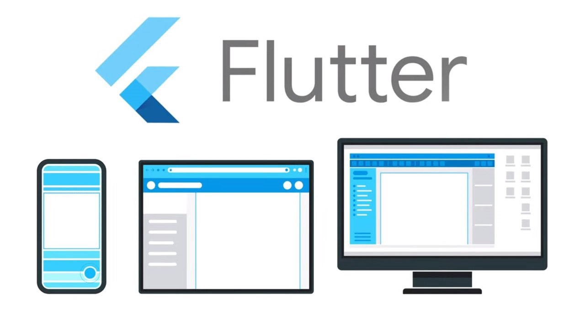

# Aplicação Expenses

Pojeto desenvolvido em **Flutter/Dart**, cuja finalidade é realizar o controle de despesas em determinado período.

## Funcionalidade

1. Permite o Cadastramento de Novas Despensas bem a exclusão também.
2. Disponibiliza cálculo e gráfico das despesas realizadas nos últimos 7 dias.
3. Disponibiliza também um listagem em scroll, com todas as despesas cadastradas.

## Tecnologias Utilizadas

* Flutter
* Dart
* Java
* Git

## Getting Started

This project is a starting point for a Flutter application.

A few resources to get you started if this is your first Flutter project:

- [Lab: Write your first Flutter app](https://flutter.dev/docs/get-started/codelab)
- [Cookbook: Useful Flutter samples](https://flutter.dev/docs/cookbook)

For help getting started with Flutter, view our
[online documentation](https://flutter.dev/docs), which offers tutorials,
samples, guidance on mobile development, and a full API reference.
